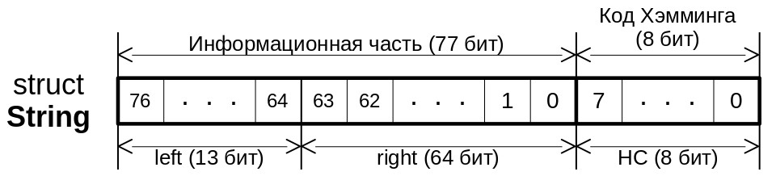
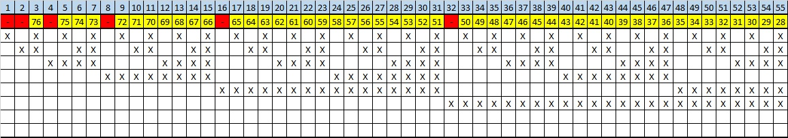
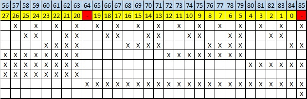
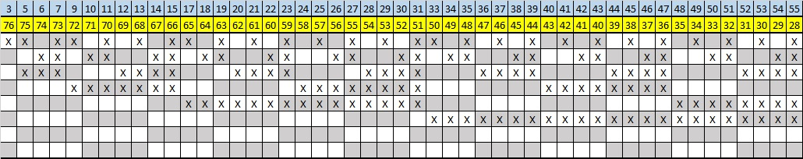
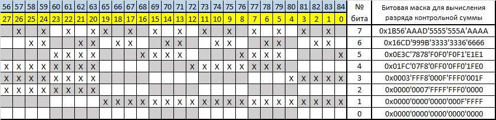

<h1>GLONASS string</h1>

<h3>Общие сведения</h3>
Данное программное обеспечение (ПО) предназначено для генерации строки навигационного сообщения системы ГЛОНАСС, выявления факта наличия ошибок в строке при однократном и двухкратном и четырехкратном числе искаженных бит, а также для подтверждения возможности исправления однократных ошибок. Структура строки навигационного сообщения:

Строка состоит из последовательности нулей и единиц длиной 85 бит: 77 бит - информационные, 8 бит - код Хэмминга (контрольная сумма). На схеме также отображены составляющие структуры String: HC (Hamming Code) - код Хэмминга, left - младшие 64 бита информационного сообщения, right - старшие 13 бит информационного сообщения.

Поскольку данная программа ориентирована преимущественно на работу с контрольной суммой, то было принято решение заполнять информационную часть строки случайным образом. Основное ядро и функционал ПО представляет собой работу с <a href="https://ru.wikipedia.org/wiki/%D0%9A%D0%BE%D0%B4_%D0%A5%D1%8D%D0%BC%D0%BC%D0%B8%D0%BD%D0%B3%D0%B0">кодом Хэмминга</a>. Более простым языком о работе алгоритма можно почитать <a href="https://habr.com/ru/post/140611/">здесь</a>. Суть данного алгоритма проще объяснить по следующей таблице:



Здесь красными ячейками с символом "-" обозначены разряды кода Хэмминга, желтые ячейки - номера разрядов информационного сообщения, голубые ячейки - порядковые номера (необходимы для правильного расположения символов кода контрольной суммы). В основной таблице символами "X" обозначены биты, которые будут учавствовать в расчете соответствующего бита контрольной суммы. Например, для расчета первого бита (по голубой шкале) кода Хэмминга (он же седьмой бит в структуре строки сообщения) необходимо произвести сложение по модулю 2 (<a href="https://ru.wikipedia.org/wiki/%D0%98%D1%81%D0%BA%D0%BB%D1%8E%D1%87%D0%B0%D1%8E%D1%89%D0%B5%D0%B5_%C2%AB%D0%B8%D0%BB%D0%B8%C2%BB">исключающее ИЛИ</a>) разрядов информационного сообщения под следующими номерами (по голубой шкале): 3, 5, 7, 9, ..., 83; для расчета второго бита: 3, 6, 7, 10, 11, ..., 82, 83 и т.д. Результат выполнения данной операции записывается в соответствующий бит контрольной суммы. Как можно заметить, разряды для расчета всех бит контрольной суммы следуют неравномерно из-за вставки этих самых бит непосредственно в само сообщение. Но т.к. в навигационном сообщении ГЛОНАСС биты контрольной суммы отделены от информационной части, то получается следующая картина:


Как видно, рассчетные биты действительно расположены неравномерно, а потому было принято решение использовать битовые маски для выделения соответствующих разрядов информационного сообщения с помощью операции побитового И (<a href="https://ru.wikipedia.org/wiki/%D0%9A%D0%BE%D0%BD%D1%8A%D1%8E%D0%BD%D0%BA%D1%86%D0%B8%D1%8F">конъюнкция</a>). Т.к. операцию сложения по модулю 2 не так просто реализовать в языке высокого уровня С, то было принято решение ее заменить подсчетом количества единиц в двоичном представлении числа и взять остаток от деления на 2 полученного результата. Справедливость данного подхода покажем на следующем примере:

Пусть имеется двоичное число 1011. Тогда сложение по модулю 2 между разрядами: 1 ^ 0 ^ 1 ^ 1 = 1. Количество единиц в данном числе 3, а значит остаток от деления 3 на 2 равен 1, что совпадает с результатом поразрядного исключающего ИЛИ.

Именно таким образом и реализован функционал вычисления контрольной суммы в разработанном ПО. Исправление поврежденного бита производится на основе вычисления номера искаженного разряда, которое производится следующим образом:  
Пусть есть код Хэмминга исходного сообщения 00011010 и поврежденного сообщения 00110000. Выполняем операцию сложения по модулю 2 для вычисления разницы между данными кодами: 00011010 ^ 00110000 = 00101010. После этого полученное число следует <a href="https://stackoverflow.com/questions/2602823/in-c-c-whats-the-simplest-way-to-reverse-the-order-of-bits-in-a-byte">реверсировать</a>; получаем число 01010100 = 84. Результат (число 84) соответствует порядковому номеру бита по голубой шкале (см. таблицы выше). Для определения порядкового номера этого же бита в структуре строки (желтая шкала) следует вычесть количество предшествующих вставленных бит кода Хэмминга (количество вставленных красных ячеек до 84-ой), т.е. 7: 84 - 7 = 77. И наконец, истинный номер поврежденного бита вычисляется по следующей формуле: y = 77 - x, где x - только что вычисленное число (77). В итоге, порядковый номер искаженного разряда в данном примере: 77 - 77 = 0.

<h3>Требования</h3>

- один из дистрибутивов семейства Debian
- GLIBC 2.31 или новее
- GCC 10.2.1 или новее
- GNU Make 4.3 или новее

<h3>Скачивание и сборка</h3>
Необходимо скачать последний доступный <a href="https://github.com/VasiliyMatlab/GLONASS-string/releases">релиз</a> себе на диск, затем разархивировать его в командной оболочке:

если архив расширения `.zip`, то выполнить следующую инструкцию:
```bash
unzip GLONASS-string-N.N.zip
```
если архив расширения `.tar.gz`, то выполнить следующую команду:
```bash
tar xvf GLONASS-string-N.N.tar.gz
```
Следующим шагом является сборка проекта с помощью утилиты `make`:
```bash
cd GLONASS-string-N.N/src/
make
cd ../bin/
ls
```
После выполнения указанных действий в списке содержимого папки `bin/` должен появиться бинарный файл `GLONASS_string`. Если данный файл в результате выполнения указанных действий, не был создан - обратитесь к автору данной программы

<h3>Использование</h3>
Запустите на выполнение бинарный файл:

```bash
./GLONASS_string
```
В консоль выведется сгенерированная строка навигационного сообщения ГЛОНАСС с уже вычисленным кодом Хэмминга. Далее программа попросит вас ввести одно из чисел (1, 2 или 4), которое будет соответствовать количеству искаженных бит в поврежденной строке.
- В случае ввода числа "2" или "4" ПО случайным образом определит номера искаженных бит и выведет поврежденную строку в консоль.
- В случае ввода числа "1" ПО спросит пользователя, сам ли он хочет ввести порядковый номер бита ошибки (Да или Нет).
  - Если ответить "Да", то необходимо будет ввести номер бита ошибки (от 0 включительно до 76 включительно)
  - Если ответить "Нет", то программа случайным образом сама определит номер искаженного бита и выведет его на экран.  

После данных действий ПО выведет исходную и поврежденную строки и вычислит в автоматическом режиме номер искаженного бита с помощью различий в контрольных суммах.

***
<p align="center"><a href="https://github.com/VasiliyMatlab"></a></p>
<p align="center"><a href="https://github.com/VasiliyMatlab" style="color: #000000">VasiliyMatlab</a></p>
